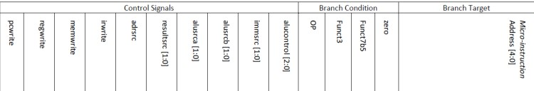
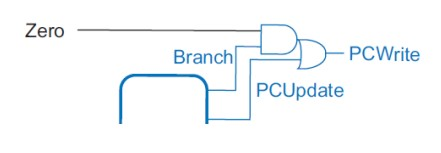
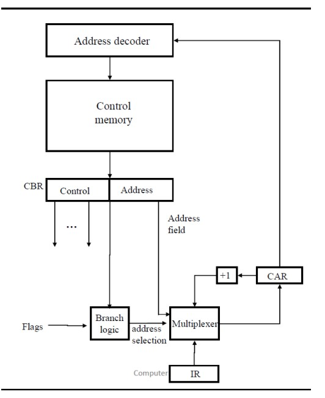
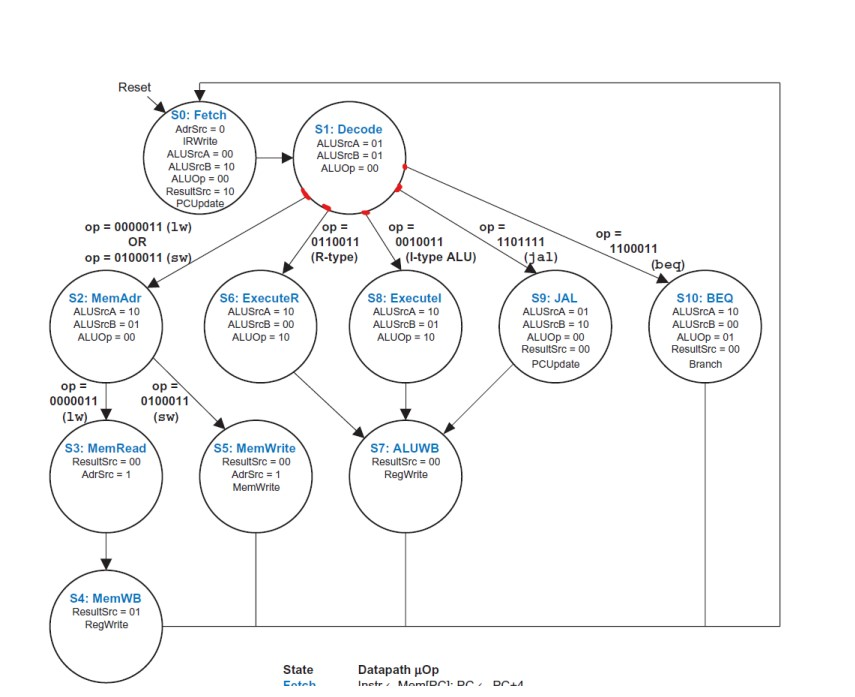
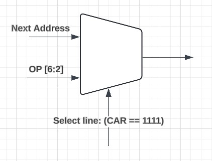
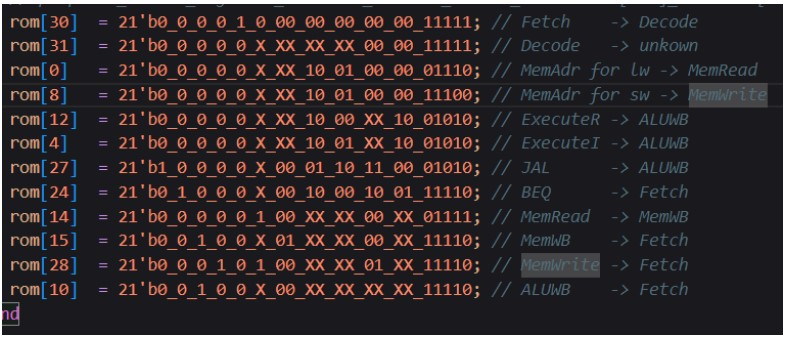
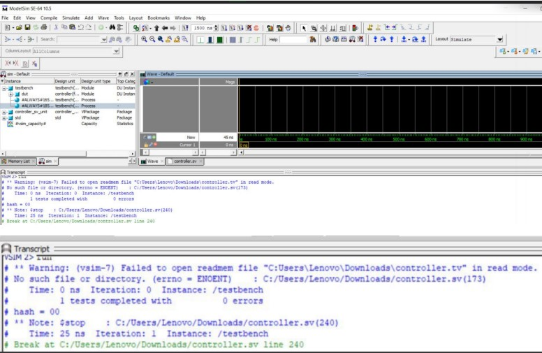
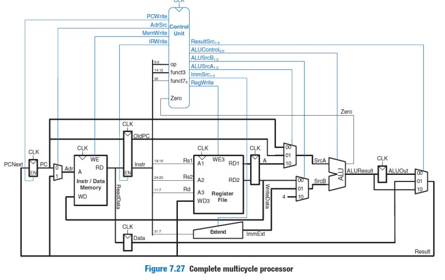

# Micro-programmed RISC-V

Computer Architecture course final project Spring 2023, instructor: Seyed-Hosein Attarzadeh-Niaki Assistant Professor at Shahid Beheshti University (SBU).

This project involves the implementation of a multi-cycle processor with a microprogrammed controller module. The main challenge encountered was the design and implementation of a detailed datapath and the integration of the microprogrammed control module.

## Documentation

### Key component
- ### Controller:

     The controller is implemented using a finite state machine (FSM) to manage the various states of the processor.
     it utilizes a ROM to store micro-instructions, which are executed sequentially.
     - initial control word:
       
         

        changes: Instead of alucontrol, we store the value of aluop, because the value of alucontrol is different for each type-R and type-I calculation instruction, and this causes the number of Word Controls that we store in ROM to increase, as well as the handling of instruction nexts. It gets hard.Condition Branch values ​​are also given as input to the module and there is no need to save them, and the zero value does not depend on the type of instruction and is related to the source registers of that instruction.
    - PCWrite:
      
         

        The value of pcwrite is also sometimes related to the value of zero (in beq), so, in CW, Branch and PCUpdate values ​​are kept and after reading their values ​​from ROM, they enter this circuit
are simplified to specify the value of PCWrite.

    - next microinstruction:
 
      

      We make a change in this structure as well
Instead of adding an address, we give another input to the multiplexer
To handle the Decode state, which goes to 5 other states after itself, but with a higher structure than each
Microinstruction can go to the following two modes.

    ### **solution**:

  

    Solution:
  In state decoding, we should be able to determine the address of the next 5 states
  Our addresses are 5 bits
  If we pay attention to the opcodes, which are a condition for transition, we will notice that their 5 most valuable bits are unique and two
  All low value bits are 11
  We use these 5 bits as the address of the next microinstruction
  We save CW and now we choose between these two values ​​with a multiplexer that if we were in the Decode state
  The value of the upper 5 bits of the opcode should be selected (next value for the CW of this micro-instruction equal to the address).
  We put it ourselves that of course he will not be selected in any case and it doesn't matter what it is! (Otherwise, Next State.)
  
    
  
    Note: There are two modes for MemAdr where the values ​​of the control signals will be the same and only in ROM
    It is saved twice, once for sw and another time for lw.
  
    
  
    The initial value of Register Address Control will be equal to the state address of Fetch.
    Get the control signals of each microinstruction based on figures 32 34 36 38 40 42 of chapter seven.
    We bring it and save it in ROM. The next microinstruction is specified in the commented section.
    By giving the address stored in CAR to ROM, we store CW in the CBR buffer and obtain the next address and control signals.
  

  ### simulation results :
    
  
    successfully passed all the tests.
      

- ### Datapath:

    

  
    - The datapath is designed based on the typical structure used for single-cycle processors, with necessary modifications for multi-cycle operation.
    there wasn't any significant challenge and it was a straightforward process.

